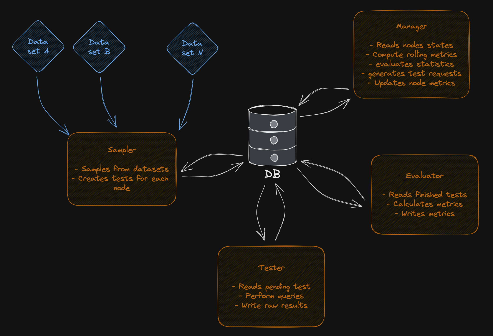

# Pocket Network Machine Learning Test-Bench

This repository contains tools for deploying and measure Machine Learning (ML) suppliers staked in the Pocket Network.
The code available here was created initially under the [POKT AI Lab](https://forum.pokt.network/t/open-pokt-ai-lab-socket/5056) socket.

# Dev Deployment

We use [TILT](https://docs.tilt.dev/) for development purposes. Please go to the [tilt section](./tilt/README.md) for more information.

# The Test-Bench

The Pocket Network test bench is an environment used to verify the correctness or soundness of an staked model, live on the network. 
It works by streamlining the tracking, sampling and execute `tasks` in a performant and scalable way. Each of these `tasks` is a instance of a particular metric, for example, the `GLUE` dataset. The architecture of the project is thought to be agnostic of the task to perform, and easily extendable. 
The test bench follows the structure presented in the following image:

As it can be seen the test-bench has five main blocks (each a different App), that work together to track the task's `scores` of each of the Pocket suppliers and create a metric taxonomy of them. Briefly, the apps do the following:
- **Manager :** Keeps the records of each supplier's scores. It checks for new suppliers, reviews the age and statistics of the task scores and requests more tasks to be executed. If there are finalized tasks (resulting from the Evaluator) it adds them to the supplier score tracking database.
- **Sampler :** Checks for Manager requests and prepares the tasks to be done. In order to do that it keeps track of available datasets (if needed) and sample from them. The result of this App is a generic call request that is correct for the Pocket Service but independent of the task.
- **Requester :** It controls the relays done. Using the provided `Pocket Network App Keys` it checks the current sessions and looks for suppliers that have pending tasks requests (generated by the Sampler). When it finds a match, it performs the relays against the suppliers and saves the raw answer.
- **Evaluator :** Retrieves the responses of the Requester and finds the originating task requests, then it calculates the appropriate metrics and writes the resulting values.
- **Summarizer :** Retrieves the scores for each supplier on each task and constructs the taxonomy summaries. The result is a unique entry on a database containing the scores on the taxonomies nodes for each pair of supplier-taxonomy.

The Apps are all coordinated using [Temporal IO](https://temporal.io/), with the Manager and Requester being recurrent workflows and Sampler and Evaluator being triggered by the Manager and Requester respectively. The datasets are stored using [PostgreSQL](https://www.postgresql.org/) since it is the most effective way to handle datasets from the [LMEH](https://github.com/EleutherAI/lm-evaluation-harness) test suite which is the first to be implemented. The data communication between apps is done via [MongoDB](https://www.mongodb.com/), which is also the holder of the `suppliers` collection, the one with the resulting scores for each tested supplier.

For more details on how the Apps interact, please read the [Apps Readme](./apps/README.md).