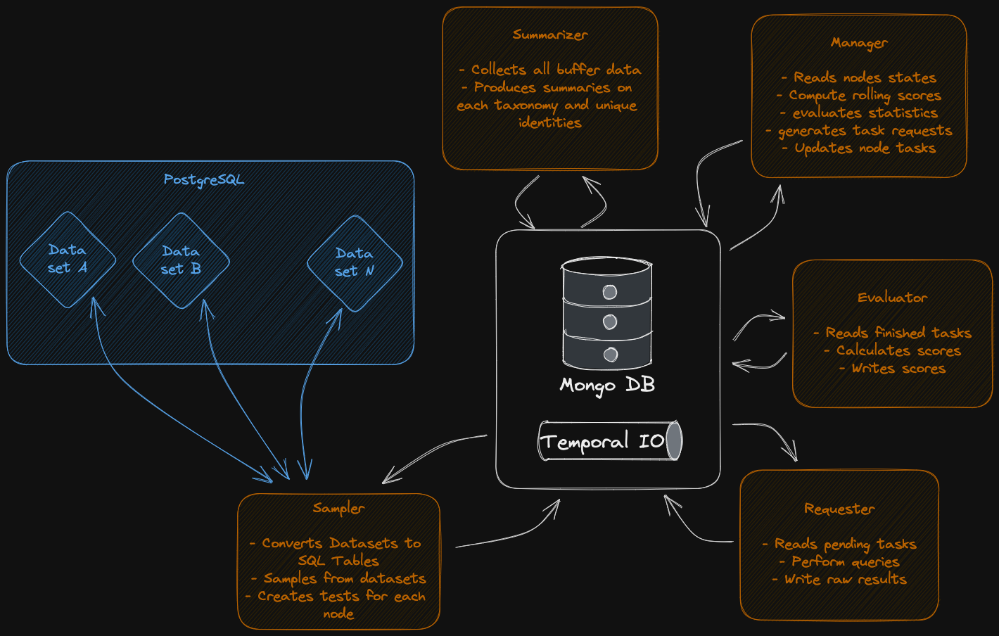

# Pocket Network Machine Learning Models Testbench

This repository contains tools for measuring the quality of Machine Learning (ML) models deployed in the Pocket Network.
The code available here was created under the [POKT AI Lab](https://forum.pokt.network/t/open-pokt-ai-lab-socket/5056) socket.

# Guides

- Model Deployment
    - [Large Language Models](./model-deployment/llm/README.md)
    - [Diffuser Models](./model-deployment/diffusers/README.md)

- Testing
    - [Morse Localnet](./morse-localnet-poc/README.md)

# Concept

This metrics module will work by managing a group of datasets and aplying tests over the Pocket Network's nodes, checking their quality and building up a database of their current performance. 
This module is composed of four apps, each performing a given set of tasks:
