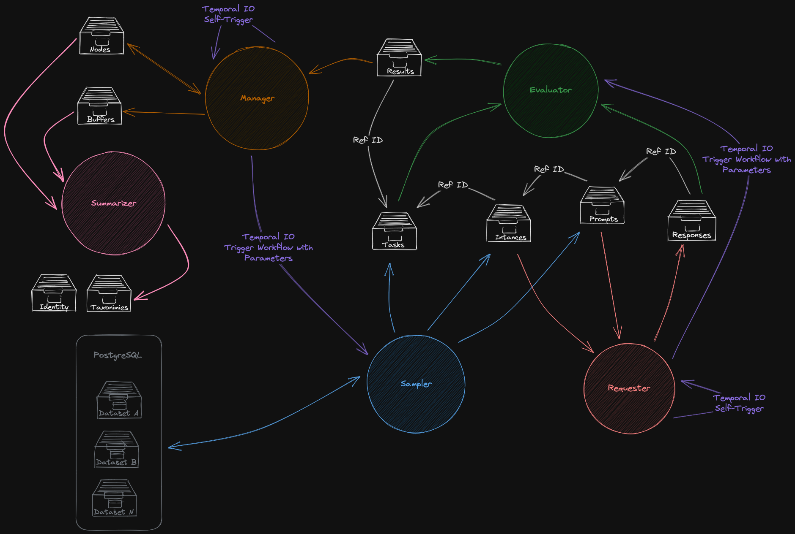

# Pocket ML Test-Bench Applications

These applications are the five main parts of the ML test-bench, each of them is an independent Temporal IO worker that listens on their own queue with specific workflows. Using Temporal IO as a coordinator, each App can be independently deployed and scalded depending on the need and workload.

The Apps interaction is summarized in the following image:

In the graph, each different app was represented using a different color, that reveals its interactions with others. The interactions with Temporal IO are shown in violet and the Database elements in white. The collections are described using the "archive" icons, the ones in white are kept in MongoDB, those that are in dark grey are kept in PostgreSQL.

- **Manager [Orange]:** It keeps the `Suppliers` collection updated, by reading the `Results` collection that contains new results to the previously requested tasks. This App is self-triggered given a fixed amount of time to perform periodic checks on the staked suppliers, each time detects the need of new measurements, it tiggers the `Sampler` App sample workflow.
- **Sampler [Blue]:** When the sampler workflow is triggered it will be done for an specific task, the result of this call will be entries in three different collections, the `Tasks` collection that will hold the task metadata, the `Instances` collection that will hold the specific realization of that task request (number of samples and request details and options) and the `Prompts` collection that holds raw prompts (long text excerpts or binary data). Also it will mantain the `Datesets DB` updated, if a requested task is not in the database, it will look for it and write it in the correct format. 
- **Requester [Red]:** It keeps the `Instances` collection empty. This App is self trigger periodically to check for new entries in the `Instances` collection and the current session available suppliers. If it finds a match, an instance for a supplier that is in a session with one of its Pocket Network Apps, then the workflow will trigger the activities responsible for doing the relays. These activities will read the instance and look for the corresponding prompts/inputs in the `Prompts` collection (using the provided reference IDs between collections). As a result of the relay, they will write the supplier response to the `Responses` collection and trigger the evaluation workflow of the `Evaluator` App.
- **Evaluator [Green]:** After being triggered, the evaluation workflow will reconstruct the full task by means of the provided reference ID, collecting the data from the `Tasks`, `Instances`, `Prompts` and `Responses` collections. It will then do the specific calculations that were requested and write the resulting scores in the the `Results` collection.
- **Summarizer [Pink]:** Periodically wakes up, calculates the summaries for each supplier on each of the loaded taxonomies and analyses the signatures to detect duplicated backends. For the taxonomy summary, it first retrieves all suppliers from the `Suppliers` collection and then looks into the `Buffers_numerical` collection for all tasks required in a given taxonomy. With all the tasks' data it calculates the scores of each of the taxonomy nodes and produces a summary in the `taxonomy_summaries` collection. In the case of the identity summary, it analyzes all entries in the `Buffers_signatures` that correspond to the `identity` task. It gather every supplier tracked and compares the set of signatures from each and produces a list of unique suppliers and those that have repeated backends (i.e. they are the same model). Then it selects a proxy for all the repeated backends and writes the `identity_summaries`, indicating which supplier is unique and which is proxies by another. Finally it updates the `Buffers_signatures` entries of the the `identity` to signal which supplier should be measured.
